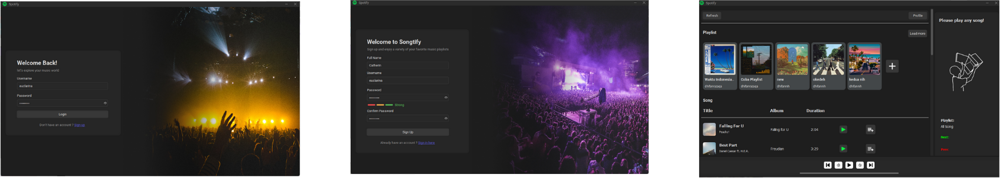

# Java - Music Apps
inspiration from Spotify

## Authors

- [@dhifanrazaqa](https://github.com/dhifanrazaqa)
- [@FajarRamadhanBBX](https://github.com/FajarRamadhanBBX)

## Description
This application is built using java swing with some help such as using:
- Miglayout
- Flatlaf
- PostgreSQL

## Features
- Login
- Register
- Add Music
- Add Album
- Add Music to Album
- Log out

## How to Run
Pastikan versi JDK yang terinstall sesuai dengan versi JDK pada pom.xml
Buat file .env dan letakkan pada src/main/resources
File .env harus dengan format berikut:

JDBC_URL="urldb"

JDBC_USER="user"

JDBC_PASSWORD="password"

## Screenshots

